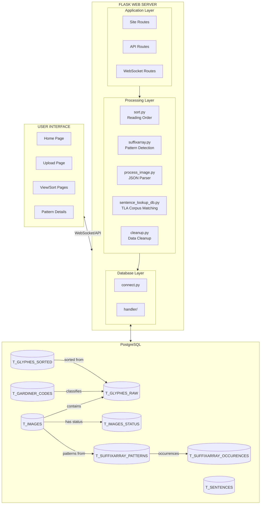
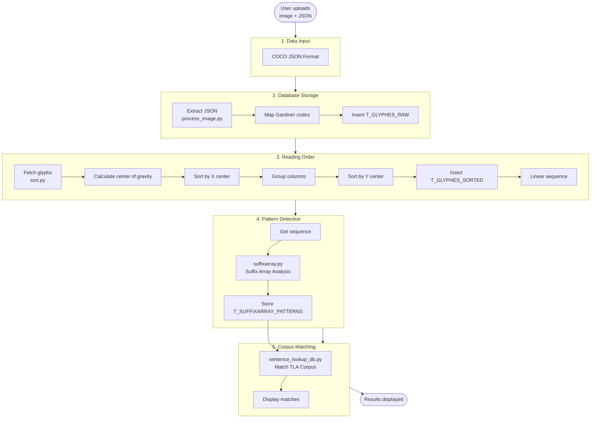
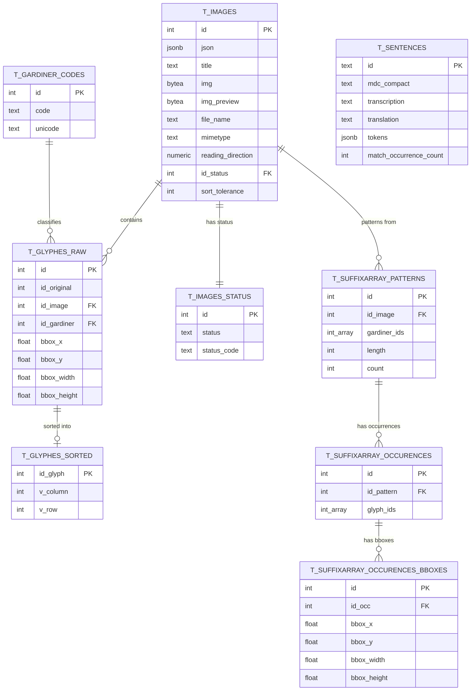

# Hieroglyphic Pattern Analyzer

Computational reconstruction of reading order and pattern detection in Ancient Egyptian manuscripts.

## Table of Contents

- [Hieroglyphic Pattern Analyzer](#hieroglyphic-pattern-analyzer)
  - [Table of Contents](#table-of-contents)
  - [Overview](#overview)
    - [Research Question](#research-question)
    - [What This Tool Does](#what-this-tool-does)
    - [Dataset](#dataset)
  - [System Architecture](#system-architecture)
  - [Data Flow](#data-flow)
  - [Database Schema](#database-schema)
  - [Installation](#installation)
    - [Prerequisites](#prerequisites)
    - [Setup](#setup)
  - [Usage](#usage)
  - [Project Structure](#project-structure)
  - [Acknowledgements](#acknowledgements)

---

## Overview

### Research Question

*How can computational methods reconstruct the reading order and identify recurring hieroglyphic sequences in annotated Spell 145 of the Book of the Dead of Nu using spatial and categorical information derived from CVAT-generated JSON data?*

### What This Tool Does

1. Reconstructs reading order from 2D hieroglyphic annotations using spatial positioning
2. Detects recurring patterns in hieroglyphic sequences using n-gram analysis
3. Visualizes results through an interactive web interface

### Dataset

- **Source**: Book of the Dead of Nu (BM EA 10477, 18th Dynasty)
- **Focus**: Spell 145, Sheet 25
- **Content**: 2,432 manually annotated hieroglyphs across 59 vertical columns
- **Format**: COCO-style JSON from CVAT

---

## System Architecture



---

## Data Flow



---

## Database Schema



---

## Installation

### Prerequisites
- Python 3.10+
- PostgreSQL 12+

### Setup

```bash
# Install dependencies
pip install -r requirements.txt

# Configure database (.env file in src/database/)
DB_USER=your_username
DB_PASS=your_password
DB_HOST=localhost
DB_PORT=5432
DB_NAME=hieroglyphics_db

# Run application
make run
```

Access at http://localhost:5001

---

## Usage

```bash
# Upload papyrus image + JSON at http://localhost:5001/upload
# Returns image_id (e.g., 2)

# Process annotations
python -m src.process_image 2

# Reconstruct reading order
python -m src.sort 2 100

# Detect patterns
python -m src.suffixarray 2

# View results at http://localhost:5001/papyri
```

---

## Project Structure

```
src/
├── app/                    # Flask web interface (routes, static, templates)
├── database/               # PostgreSQL connection and handlers
├── process_image.py        # COCO JSON parser
├── sort.py                 # Reading order algorithm
├── suffixarray.py          # Suffix array pattern detection
├── sentence_lookup_db.py   # TLA corpus matching
└── cleanup.py              # Data cleanup utilities
```

---

## Acknowledgements

Developed at Freie Universität Berlin as part of "Projektseminar Informatik und Archäologie."

**Contributors**: Margot Belot, Eren Kocadag, Philipp Schmidt  
**Supervisors**: Prof. Dr. Agnès Voisard, Prof. Dr. Mara Hubert
