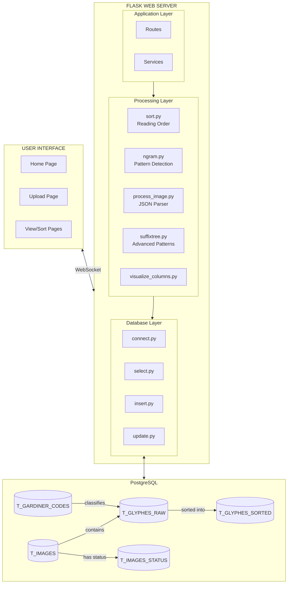
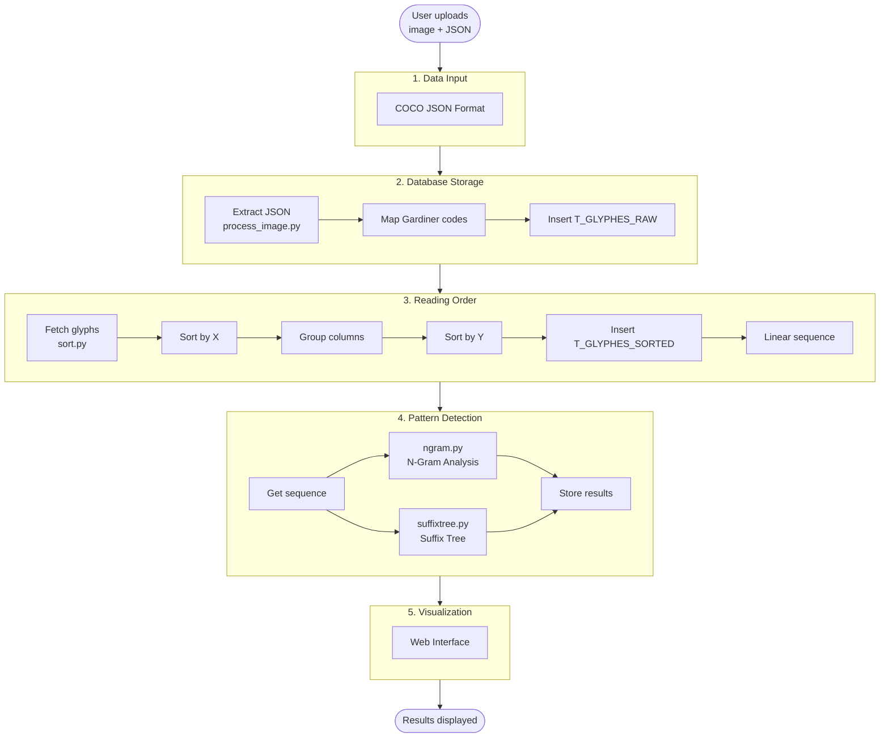
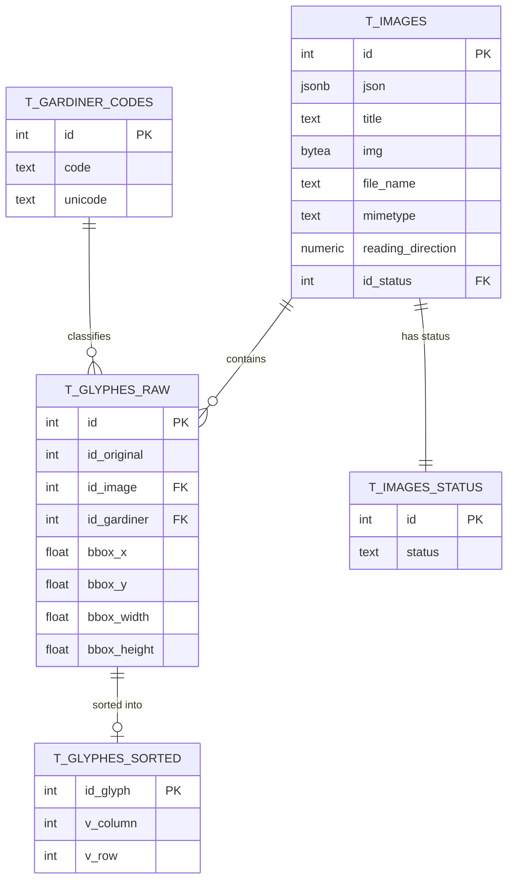
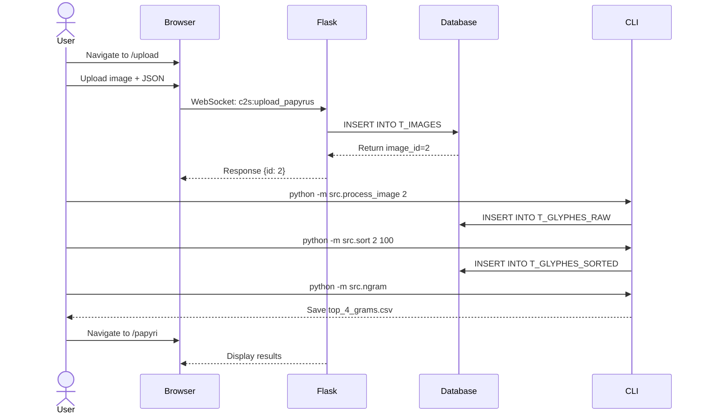

# Hieroglyphic Pattern Analyzer

**Computational reconstruction of reading order and pattern detection in Ancient Egyptian manuscripts**

An interdisciplinary project analyzing recurring sequences and patterns in Egyptian hieroglyphs from the Book of the Dead of Nu (British Museum EA 10477, Spell 145).

---

## Table of Contents

- [Overview](#overview)
- [System Architecture](#system-architecture)
- [Data Flow](#data-flow)
- [Database Schema](#database-schema)
- [Installation](#installation)
- [Usage](#usage)
- [Core Components](#core-components)
- [API Reference](#api-reference)
- [Development](#development)
- [Acknowledgements](#acknowledgements)

---

## Overview

### Research Question

*How can computational methods reconstruct the reading order and identify recurring hieroglyphic sequences in annotated Spell 145 of the Book of the Dead of Nu using spatial and categorical information derived from CVAT-generated JSON data?*

### What This Tool Does

1. **Reconstructs reading order** from 2D hieroglyphic annotations using spatial coordinates
2. **Detects recurring patterns** in hieroglyphic sequences using n-gram analysis and suffix trees
3. **Visualizes results** on the original papyrus images through an interactive web interface

### Dataset

- **Source**: Book of the Dead of Nu (BM EA 10477, 18th Dynasty, c. 1550-1295 BCE)
- **Focus**: Spell 145, Sheet 25 (traversing the portals of the Field of Reeds)
- **Content**: 2,432 manually annotated hieroglyphs across 59 vertical columns
- **Format**: COCO-style JSON from CVAT annotation tool
- **Size**: ~2.2 MB (annotations.json: 2.1 MB, analysis outputs: ~140 KB)
- **Accessibility**: Data stored in PostgreSQL database and local `data/` directory. Original papyrus images from British Museum (public domain).

---

## System Architecture



---

## Data Flow



---

## Database Schema



---

## Installation

### Prerequisites

- Python 3.10+
- PostgreSQL 12+
- pip or uv package manager

### Step 1: Clone Repository

```bash
git clone <repository-url> hieroglyphic-pattern-analyzer
cd hieroglyphic-pattern-analyzer
```

### Step 2: Install Dependencies

```bash
# Using pip
pip install -r requirements.txt

# OR using uv (faster)
make uv-env
```

### Step 3: Configure Database

Create `.env` file in `src/database/`:

```env
DB_USER=your_username
DB_PASS=your_password
DB_HOST=localhost
DB_PORT=5432
DB_NAME=hieroglyphics_db
```

Test connection:
```bash
python -m src.database.connect
```

### Step 4: Create Database Schema

```sql
-- Create status lookup table
CREATE TABLE T_IMAGES_STATUS (
    id INT PRIMARY KEY,
    status TEXT NOT NULL
);

INSERT INTO T_IMAGES_STATUS (id, status) VALUES
(1, 'pending'),
(2, 'processed'),
(3, 'error');

-- Create main images table
CREATE TABLE T_IMAGES (
    id SERIAL PRIMARY KEY,
    json JSONB,
    title TEXT,
    img BYTEA,
    file_name TEXT,
    mimetype TEXT,
    reading_direction NUMERIC(1,0),
    id_status INT REFERENCES T_IMAGES_STATUS(id)
);

-- Create Gardiner codes reference
CREATE TABLE T_GARDINER_CODES (
    id SERIAL PRIMARY KEY,
    code TEXT UNIQUE NOT NULL,
    unicode TEXT
);

-- Create raw glyphs table
CREATE TABLE T_GLYPHES_RAW (
    id SERIAL PRIMARY KEY,
    id_original INT,
    id_image INT REFERENCES T_IMAGES(id),
    id_gardiner INT REFERENCES T_GARDINER_CODES(id),
    bbox_x FLOAT,
    bbox_y FLOAT,
    bbox_width FLOAT,
    bbox_height FLOAT
);

-- Create sorted glyphs table
CREATE TABLE T_GLYPHES_SORTED (
    id_glyph INT PRIMARY KEY REFERENCES T_GLYPHES_RAW(id),
    v_column INT NOT NULL,
    v_row INT NOT NULL
);
```

### Step 5: Run Application

```bash
make run
# OR
python -m src.app
```

Access at: **http://localhost:5001**

---

## Usage

### Complete Workflow

```bash
# 1. Start the web application
make run

# 2. Upload papyrus via browser at http://localhost:5001/upload
#    Returns image_id (e.g., 2)

# 3. Extract annotations from JSON
python -m src.process_image 2

# 4. Preview column detection
python -m src.sort 2 100 --preview

# 5. Run sorting algorithm
python -m src.sort 2 100

# 6. Visualize columns (optional)
python -m src.visualize_columns 2

# 7. Detect n-gram patterns
python -m src.ngram

# 8. View results at http://localhost:5001/papyri
```

### Workflow Diagram



---

## Development

### Repository Structure

```
hieroglyphic-pattern-analyzer/
├── data/                   # Sample datasets
│   ├── annotations.json
│   └── *.csv
├── src/
│   ├── app/               # Flask application
│   │   ├── __init__.py
│   │   ├── __main__.py
│   │   ├── routes/
│   │   ├── services/
│   │   ├── templates/
│   │   └── static/
│   ├── database/          # Database layer
│   │   ├── connect.py
│   │   ├── select.py
│   │   ├── insert.py
│   │   └── update.py
│   ├── process_image.py   # Annotation processor
│   ├── sort.py            # Reading order
│   ├── ngram.py           # N-gram analysis
│   ├── suffixtree.py      # Suffix tree (WIP)
│   └── visualize_columns.py
├── requirements.txt
├── Makefile
└── README.md
```

### Roadmap

**Completed**
- [x] Database schema design
- [x] COCO JSON parsing
- [x] Reading order algorithm
- [x] Column visualization
- [x] N-gram analysis
- [x] Flask web server
- [x] WebSocket integration

**In Progress**
- [ ] Suffix tree implementation
- [ ] Pattern visualization on images
- [ ] Frontend dynamic data loading

**Planned**
- [ ] String matching UI
- [ ] Fuzzy matching for scribal variations

---

## Acknowledgements

This project was developed as part of the course "Projektseminar Informatik und Archäologie" at Freie Universität Berlin.

**Supervisors**:  
Prof. Dr. Agnès Voisard  
Prof. Dr. Mara Hubert

**Contributors**:  
Margot Belot (Digital Humanities/DISTANT)  
Eren Kocadag (Computer Science)  
Philipp Schmidt (Computer Science)

**Institution**: Freie Universität Berlin

---

**Version**: 0.1.0-alpha  
**Last Updated**: December 14, 2025
